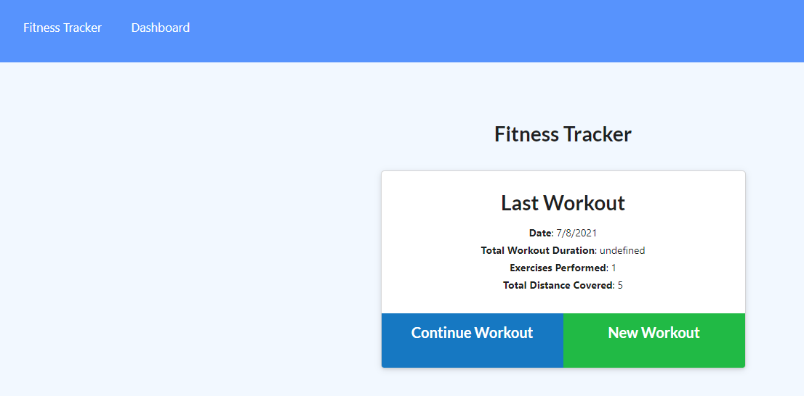
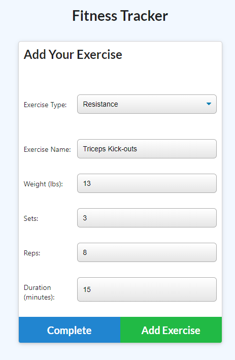
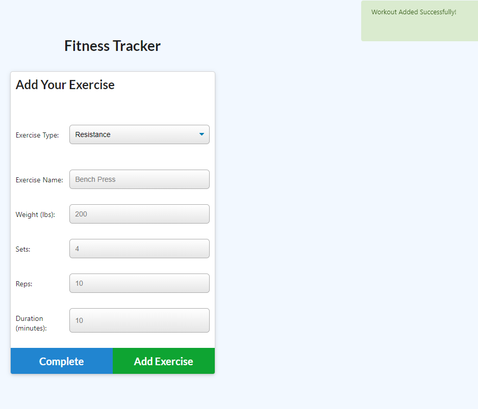

## Project Headline: Fitness Tracking Made Easy   
    Table of Contents:  
[Project Why](#why) 
[Project Designers Contact/Github](#contact)   
    
    
## Why, What and How, Installation, Usage, Contributors, and Testing
#### (why)
  
Project Why: We should all want one place to find our past workouts and add new ones. Our Fitness Tracking App lets you do just that quickly and easily.
 
Project What: The application is fully deployed to the web (Heroku) and uses a Mongo/Atlas database to keep track of information.
 
Project How: The application is fully deployed to the web (Heroku) and uses a Mongo/Atlas database to keep track of information.
 
Installation Instructions:  https://fitness-tracker-dtm-hw17.herokuapp.com/
 
Usage Information: Anyone can Whistle. Just go to the location and use the app.

Repo: https://github.com/dtmerrill/fitness-tracker

 
Guidelines for Contributions to this Project:  Just ask nicely, please.
 
Relevant Tests: No.
 
 
## Contact, Github, Email, License
#### (contact information)
 
Questions Regarding this Project and/or its Usage: email
 
Project License: MIT
 
Email Project Designer: [dtmerrilliii@gmail.com](dtmerrilliii@gmail.com/)
 
Designers Github Page: https://github.com/dtmerrill 